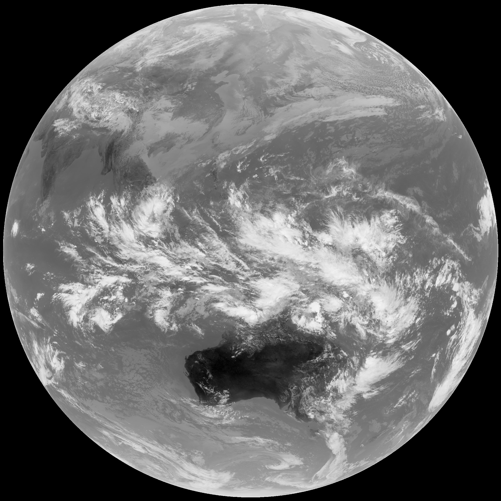
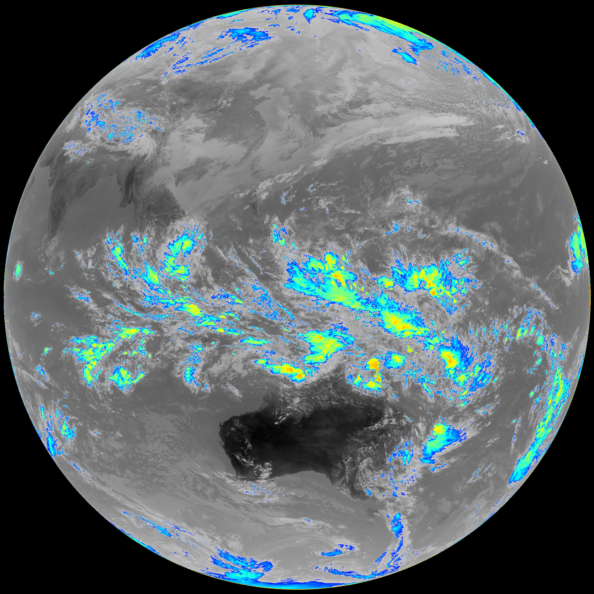

# GK2A Proc
Process GK2A LRIT images.

## Setup
```bash
# Install Dependencies
pip install Pillow

python3 gk2a.py <input_image> <output directory>
```


## Supported processors
|Name|Status|
|----|------|
|Thermal 🌡|Stable|
|Rainfall 🌧|Stable|


## Results

### Input Image


### Thermal


### Rainfall

